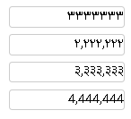

# Persian Number Input

🌟 **React Persian Number Input Component**

---

[English 🇺🇸](#-english)| [فارسی 🇮🇷](#-فارسی)

---

## 🇺🇸 English

Persian Number Input - React Component for Persian, English & Indic Number Formatting

Easily input, format, and convert numbers in Persian, English, or Indic digits with customizable digit separators. Lightweight, React-compatible, and fully localized for React versions 16 to 19.

✅ **Key Features:**

- Support for Persian, English, and Indic digit localization
- Customizable digit grouping separators (e.g., commas)
- Automatically converts localized digits to standard English digits
- Simple, easy-to-integrate React API

### 🚀 Installation

```bash
npm install persian-number-input
```


### 💻 Usage Example

Simple usage example:

```jsx
import React, { useState } from "react";
import { PersianNumberInput } from "persian-number-input";

const App = () => {
  const [number, setNumber] = useState("");

  return (
    <PersianNumberInput
      initialValue="123456"
      separatorCount={3}
      lang="fa"
      onChangeValue={(val) => setNumber(val)}
    />
  );
};

export default App;
```

### 🔥 Output Example

```
Input: 123456
Displayed Output: ۱۲۳,۴۵۶
English Output: 123456
```



### 📚 Props Reference

| Name           | Type                            | Default | Description                          |
| -------------- | ------------------------------- | ------- | ------------------------------------ |
| initialValue   | string                          | ""      | Initial input value                  |
| separatorCount | number                          | 0       | Number of digits per group (e.g., 3) |
| separatorChar  | string                          | ","     | Digit grouping character             |
| lang           | 'fa' \| 'in' \| 'en'            | "fa"    | Digit localization language          |
| onChangeValue  | (englishNumber: string) => void | -       | Callback function on value change    |

---

### ❓ FAQ (Frequently Asked Questions)

**Does this package support React 19?**  
Yes, it fully supports React versions 16 through 19.

**What is the best use-case scenario for this component?**  
Ideal for multilingual web applications, forms, and any interface requiring localized numeric inputs.

**How can I customize the styles of this component?**  
You can pass custom classes or inline styles directly to the component to match your design requirements.

---

### 🌟 Support the Project

If you find this package helpful, **please give it a star ⭐ on GitHub** to encourage further improvements.

👉 **[GitHub Repository](https://github.com/javadSharifi/persian-number-input)**

Thank you for your support! ❤️🚀

---

### 📈 SEO Keywords

`Persian Number Input`, `React Persian input`, `localization`, `digit grouping`, `Persian digits`, `React numeric input`, `number formatter`

---

### 📄 License

[MIT License](LICENSE)

© 2024 Your Name. All rights reserved.

# persian-number-input

## 🇮🇷 فارسی

کامپوننت React برای ورودی اعداد فارسی، انگلیسی و هندی با قابلیت جداکننده ارقام و محلی‌سازی کامل.

✅ **امکانات کلیدی:**

- پشتیبانی از اعداد فارسی، انگلیسی و هندی
- قابلیت تعیین جداکننده ارقام دلخواه (هزارگان)
- تبدیل خودکار اعداد محلی به اعداد انگلیسی
- استفاده آسان و پشتیبانی از React نسخه‌های 16 تا 19

### 🚀 نصب

```bash
npm install persian-number-input
```

### 💻 روش استفاده

مثال ساده:

```jsx
import React, { useState } from "react";
import { PersianNumberInput } from "persian-number-input";

const App = () => {
  const [number, setNumber] = useState("");

  return (
    <PersianNumberInput
      initialValue="123456"
      separatorCount={3}
      lang="fa"
      onChangeValue={(val) => setNumber(val)}
    />
  );
};

export default App;
```

### 🔥 مثال خروجی

```
ورودی: 123456
خروجی نمایشی: ۱۲۳,۴۵۶
خروجی انگلیسی: 123456
```


### 📚 مشخصات Props

| نام            | نوع                             | پیشفرض | توضیح                            |
| -------------- | ------------------------------- | ------ | -------------------------------- |
| initialValue   | string                          | ""     | مقدار اولیه                      |
| separatorCount | number                          | 0      | تعداد ارقام جداشده (مثلاً ۳ رقم) |
| separatorChar  | string                          | ","    | کاراکتر جداکننده (مانند `,`)     |
| lang           | 'fa' \| 'in' \| 'en'            | "fa"   | زبان نمایش ارقام                 |
| onChangeValue  | (englishNumber: string) => void | -      | فراخوانی در تغییر مقدار          |

---

### 🌟 حمایت از پروژه

اگر این پکیج برای شما مفید بود، **لطفاً یک ستاره به مخزن GitHub بدهید ⭐**. این بهترین راه برای حمایت از پروژه و تشویق توسعه‌دهنده به بهبود آن است.

👉 **[GitHub Repository](https://github.com/javadSharifi/persian-number-input)**

از حمایت شما متشکریم! ❤️🚀
