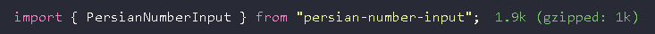

# Persian Number Input

[فارسی](./README.fa.md) | English
A lightweight, powerful React library for handling Persian (Farsi) and Arabic number inputs with automatic digit conversion, formatting, and localization support.

[](https://www.npmjs.com/package/persian-number-input)
[](https://www.npmjs.com/package/persian-number-input)
[](https://bundlephobia.com/package/persian-number-input)
[](https://github.com/javadSharifi/persian-number-input/blob/main/LICENSE)

## 🚀 [Live Demo](https://persian-number-input.netlify.app/)
---

Experience the component in action with our interactive demo!

## 📊 Bundle Size

This library is extremely lightweight:

```
persian-number-input: ~1KB (minified + gzipped)
```




---

## ✨ Features

- 🔢 **Automatic Digit Conversion** - Seamlessly converts Persian (۰-۹) and Arabic (٠-٩) digits to English and vice versa
- 🌍 **Multi-locale Support** - Built-in support for Persian (fa), Arabic (ar), and English (en)
- 📊 **Number Formatting** - Automatic thousand separators with customizable characters
- 💰 **Currency Ready** - Add prefixes, suffixes, and custom decimal separators
- ⚡ **Lightweight** - Tiny bundle size with zero dependencies (except decimal.js for precision)
- 🎯 **Type-Safe** - Full TypeScript support with complete type definitions
- ♿ **Accessible** - Follows best practices for input accessibility
- 🎨 **Customizable** - Extensive configuration options for any use case
- 🔄 **Real-time Formatting** - Format numbers as users type with cursor position preservation
- ✅ **Validation** - Built-in min/max value validation and decimal precision control

---

## 📦 Installation

```bash
npm install persian-number-input
```

```bash
yarn add persian-number-input
```

```bash
pnpm add persian-number-input
```

---

## 🎯 Quick Start

### Basic Usage

```tsx
import { PersianNumberInput } from "persian-number-input";

function App() {
  return (
    <PersianNumberInput
      initialValue={1234567}
      locale="fa"
      onValueChange={(value) => console.log(value)}
    />
  );
}
```

**Output:** `۱,۲۳۴,۵۶۷`

---

## 📚 Usage Examples

### Currency Input (Persian Toman)

```tsx
<PersianNumberInput
  initialValue={5000000}
  locale="fa"
  suffix="تومان"
  separatorCount={3}
  separatorChar=","
  onValueChange={(value) => console.log(value)}
/>
```

**Output:** `۵,۰۰۰,۰۰۰ تومان`

---

### Decimal Numbers with Custom Separator

```tsx
<PersianNumberInput
  initialValue={1234.56}
  locale="fa"
  maxDecimals={2}
  decimalChar="٫"
  separatorChar=","
  onValueChange={(value) => console.log(value)}
/>
```

**Output:** `۱,۲۳۴٫۵۶`

---

### Price Input with Validation

```tsx
<PersianNumberInput
  initialValue={0}
  locale="fa"
  min={0}
  max={999999999}
  suffix="ریال"
  showZero={true}
  onValueChange={(value) => console.log(value)}
/>
```

**Output:** `۰ ریال`

---

### Arabic Locale

```tsx
<PersianNumberInput
  initialValue={987654}
  locale="ar"
  separatorChar=","
  suffix="ر.س"
  onValueChange={(value) => console.log(value)}
/>
```

**Output:** `٩٨٧,٦٥٤ ر.س`

---

### Using the Hook (Advanced)

```tsx
import { usePersianNumberInput } from "persian-number-input";

function CustomInput() {
  const { value, onChange, onBlur, rawValue } = usePersianNumberInput({
    initialValue: 1000,
    locale: "fa",
    separatorCount: 3,
    maxDecimals: 2,
    min: 0,
    max: 1000000,
    onValueChange: (val) => {
      console.log("Raw value:", val); // "1000"
      console.log("Displayed value:", value); // "۱,۰۰۰"
    },
  });

  return (
    <input
      type="text"
      value={value}
      onChange={onChange}
      onBlur={onBlur}
      className="custom-input"
    />
  );
}
```

---

## 🛠️ API Reference

### PersianNumberInput Props

| Prop             | Type                                   | Default     | Description                                              |
| ---------------- | -------------------------------------- | ----------- | -------------------------------------------------------- |
| `initialValue`   | `number \| string`                     | `undefined` | Initial value of the input                               |
| `locale`         | `"fa" \| "ar" \| "en"`                 | `"fa"`      | Locale for digit conversion                              |
| `separatorCount` | `number`                               | `3`         | Number of digits between separators                      |
| `separatorChar`  | `string`                               | `","`       | Character used for thousand separator                    |
| `decimalChar`    | `string`                               | Auto        | Decimal separator character                              |
| `suffix`         | `string`                               | `undefined` | Suffix text (e.g., currency symbol)                      |
| `maxDecimals`    | `number`                               | `undefined` | Maximum decimal places allowed                           |
| `min`            | `number`                               | `undefined` | Minimum allowed value                                    |
| `max`            | `number`                               | `undefined` | Maximum allowed value                                    |
| `showZero`       | `boolean`                              | `false`     | Show zero when value is empty                            |
| `onValueChange`  | `(value: string \| undefined) => void` | `undefined` | Callback when value changes (returns raw English digits) |

All standard HTML input props are also supported.

---

### Utility Functions

#### `transformNumber(rawValue, options)`

Formats a number string according to locale and options.

```tsx
import { transformNumber } from "persian-number-input";

const formatted = transformNumber("1234567.89", {
  locale: "fa",
  separatorCount: 3,
  separatorChar: ",",
  maxDecimals: 2,
  suffix: "تومان",
});

console.log(formatted); // "۱,۲۳۴,۵۶۷٫۸۹ تومان"
```

#### `toEnglishDigits(str, decimalChar?)`

Converts Persian/Arabic digits to English digits.

```tsx
import { toEnglishDigits } from "persian-number-input";

console.log(toEnglishDigits("۱۲۳۴")); // "1234"
console.log(toEnglishDigits("٩٨٧٦")); // "9876"
```

#### `toLocalizedDigits(numStr, locale)`

Converts English digits to localized digits.

```tsx
import { toLocalizedDigits } from "persian-number-input";

console.log(toLocalizedDigits("1234", "fa")); // "۱۲۳۴"
console.log(toLocalizedDigits("5678", "ar")); // "٥٦٧٨"
```

#### `sanitizeNumericInput(value, maxDecimals?, decimalChar?)`

Cleans and validates numeric input.

```tsx
import { sanitizeNumericInput } from "persian-number-input";

console.log(sanitizeNumericInput("۱۲۳abc۴۵۶", 2)); // "123456"
console.log(sanitizeNumericInput("12.345.67", 2)); // "12.34"
```

---

## 🎨 Styling

The component accepts all standard input props, including `className` and `style`:

```tsx
<PersianNumberInput
  initialValue={1000}
  locale="fa"
  className="custom-input"
  style={{
    padding: "12px",
    fontSize: "16px",
    border: "2px solid #4F46E5",
    borderRadius: "8px",
    textAlign: "right",
  }}
/>
```

### With Tailwind CSS

```tsx
<PersianNumberInput
  initialValue={1000}
  locale="fa"
  className="w-full px-4 py-3 text-lg border-2 border-indigo-500 rounded-lg focus:outline-none focus:ring-2 focus:ring-indigo-600 text-right"
/>
```

---

## 🌟 Advanced Examples

### Financial Calculator

```tsx
import { useState } from "react";
import { PersianNumberInput } from "persian-number-input";

function LoanCalculator() {
  const [principal, setPrincipal] = useState<string>();
  const [rate, setRate] = useState<string>();
  const [years, setYears] = useState<string>();

  const calculateMonthlyPayment = () => {
    if (!principal || !rate || !years) return 0;
    const p = parseFloat(principal);
    const r = parseFloat(rate) / 100 / 12;
    const n = parseFloat(years) * 12;
    return (p * r * Math.pow(1 + r, n)) / (Math.pow(1 + r, n) - 1);
  };

  return (
    <div className="space-y-4">
      <div>
        <label>مبلغ وام:</label>
        <PersianNumberInput
          locale="fa"
          suffix="تومان"
          onValueChange={setPrincipal}
          min={0}
        />
      </div>
      <div>
        <label>نرخ سود (٪):</label>
        <PersianNumberInput
          locale="fa"
          maxDecimals={2}
          onValueChange={setRate}
          min={0}
          max={100}
        />
      </div>
      <div>
        <label>مدت زمان (سال):</label>
        <PersianNumberInput
          locale="fa"
          onValueChange={setYears}
          min={1}
          max={30}
        />
      </div>
      <p>
        پرداخت ماهیانه: {calculateMonthlyPayment().toLocaleString("fa-IR")}{" "}
        تومان
      </p>
    </div>
  );
}
```

---

### Form Integration

```tsx
import { useForm, Controller } from "react-hook-form";
import { PersianNumberInput } from "persian-number-input";

function ProductForm() {
  const { control, handleSubmit } = useForm();

  const onSubmit = (data) => {
    console.log(data);
  };

  return (
    <form onSubmit={handleSubmit(onSubmit)}>
      <Controller
        name="price"
        control={control}
        rules={{ required: true }}
        render={({ field }) => (
          <PersianNumberInput
            locale="fa"
            suffix="تومان"
            onValueChange={field.onChange}
            initialValue={field.value}
          />
        )}
      />
      <button type="submit">ثبت</button>
    </form>
  );
}
```

---

## 🔍 Why Persian Number Input?

### The Problem

Working with Persian and Arabic numerals in web applications is challenging:

- Users type in their native digits, but forms expect English digits
- Number formatting varies across locales
- Maintaining cursor position during formatting is complex
- Decimal precision handling requires careful implementation

### The Solution

Persian Number Input handles all these complexities automatically:

```tsx
// User types: ۱۲۳۴۵۶۷
// Component displays: ۱,۲۳۴,۵۶۷
// Form receives: "1234567"
```

---

## 🏆 Comparison

| Feature               | Persian Number Input | Native Input | Other Libraries |
| --------------------- | -------------------- | ------------ | --------------- |
| Auto digit conversion | ✅                   | ❌           | ⚠️ Partial      |
| Cursor preservation   | ✅                   | ❌           | ⚠️ Buggy        |
| TypeScript support    | ✅                   | ✅           | ⚠️ Varies       |
| Multi-locale          | ✅                   | ❌           | ❌              |
| Bundle size           | 🟢 Small             | 🟢 N/A       | 🔴 Large        |
| Decimal precision     | ✅                   | ❌           | ⚠️ Limited      |

---

## 🤝 Contributing

Contributions are welcome! Please feel free to submit a Pull Request.

1. Fork the repository
2. Create your feature branch (`git checkout -b feature/AmazingFeature`)
3. Commit your changes (`git commit -m 'Add some AmazingFeature'`)
4. Push to the branch (`git push origin feature/AmazingFeature`)
5. Open a Pull Request

---

## 📄 License

MIT © [Your Name]

---

## 🙏 Acknowledgments

- Built with TypeScript and React
- Uses [decimal.js](https://github.com/MikeMcl/decimal.js/) for precise decimal calculations
- Inspired by the needs of Persian and Arabic speaking developers

---

## 📞 Support

- 📧 Email: your.email@example.com
- 🐛 [Issue Tracker](https://github.com/javadSharifi/persian-number-input/issues)
- 💬 [Discussions](https://github.com/javadSharifi/persian-number-input/discussions)

---

**Made with ❤️ for the Persian and Arabic developer community**
